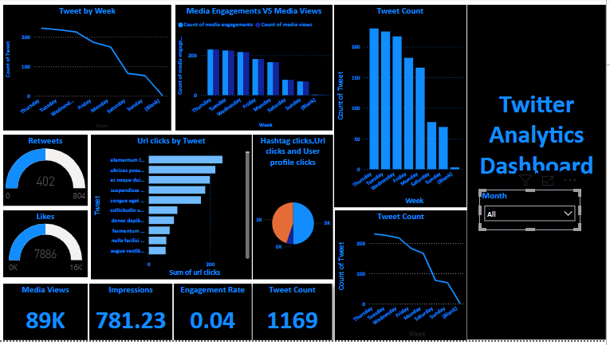

# 🐦 Tweet Analytics Power BI Dashboard

This project visualizes tweet engagement trends using Power BI.  
It features dynamic filters, time-based visibility, and interactive drill-down charts.

## 📊 Key Visuals

- **Pie Chart** showing the proportion of clicks (URL, profile, hashtag) for tweets with over 500 impressions, with drill-down to tweet level
- **Top 10 Tweets** based on retweets + likes (filtered for specific time, day, and tweet quality)
- **Line Chart** showing monthly average engagement rates, split by media and non-media tweets (time-based visibility)

## 🧠 Features

- Advanced DAX filters: odd/even checks, word count, character analysis, and tweet text quality (no words with the letter "C")
- Time-based chart visibility: only shown between **7–11 AM** and **3–5 PM IST**
- Separation of media vs non-media content trends
- Clean, responsive layout with drill-downs and interactive tooltips

## 🖼️ Dashboard Snapshots

| Page 1 | Page 2 |
|--------|--------|
|  |  |

## 📁 Files Included

- `TwitterAnalytics.pbix` – Power BI project file with full dataset and visuals
- `PowerBi_Page1.png`, `PowerBi_page2.png` – Screenshots of the dashboard

## 🛠 Tools Used

- Power BI Desktop  
- DAX (Data Analysis Expressions)  
- GitHub

---

📌 *Created as a hands-on portfolio project to demonstrate Power BI dashboarding and DAX filtering for social media analytics.*
