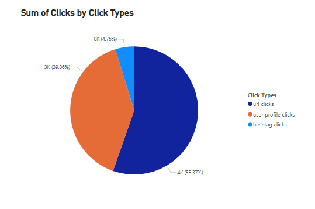
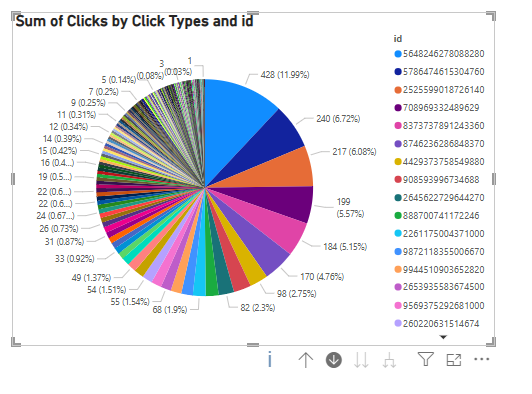

# Twitter Analytics Dashboard (Power BI)

This Power BI project analyzes tweet performance, including impressions, URL clicks, profile clicks, and hashtag clicks. It features interactive visualizations and drill-down analysis.

## 📊 Features
- Pie chart of click types
- Drill-down to view clicks per tweet
- Filter for tweets with >500 impressions

## 📁 Files
- `Twitter_Analytics_Dashboard.pbix` – Power BI report
- `SocialMedia.csv` – Sample dataset
- `Sum of Clicks by Click Types.png.png` – Dashboard preview
- `Sum of Clicks by Click Types and id.png` – Dashboard preview

## 📷 Preview

- 
  
- 

## 📎 Dataset

This project uses a dummy dataset. You can replace it with your own Twitter analytics export.

